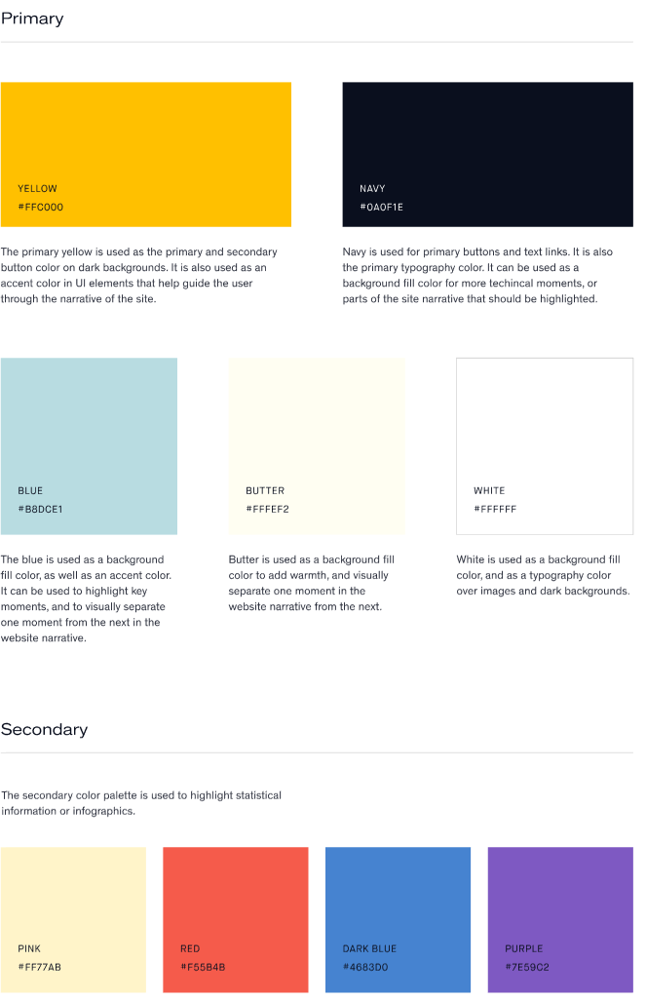

# Ezra frontend developer take home test

## Task

Following the material design principles create a basic frontend application which allows the user to view members and their appointments. How exactly you do this is left up to you as long as you fulfill the following requirements:

1. A table of members is viewable with the following columns:
    - Name
    - Email
    - Avatar
    - Actions
2. Members can be sorted on any meaningful field
3. Members can be searched by their name
4. Members can be created, deleted, or updated (with this reflected in the table)
5. Members appointments are viewable
6. Both mobile and desktop are supported and design choices differ between the two where applicable
7. Our brand colours are applied properly (for examples of our brand & design principles you can view ezra.com)

### Brand colors



## API

### Models

```typescript
interface User {
    id: string,
    firstName: string,
    lastName: string,
    email: string,
    avatar?: string,
    appointments: Appointment[]
}

interface Appointment {
    id: string,
    when: string,
    paid: boolean,
    notes?: string
}
```

### Routes

List of users: `GET /api/users`

Single user: `GET /api/users/{user.id}`

Create user: `POST /api/users` Body: `User`

Update user: `PUT/PATCH /api/users` Body: `{id: user.id, ...}`

Delete user: `DELETE /api/users/{user.id}`


List of appointments: `GET /api/appointments`

Single appointment: `GET /api/appointments/{appointment.id}`

Create appointment: `POST /api/appointments` Body: `Appointment`

Update appointment: `PUT/PATCH /api/appointments` Body: `{id: appointment.id, ...}`

Delete appointment: `DELETE /api/appointments/{appointment.id}`